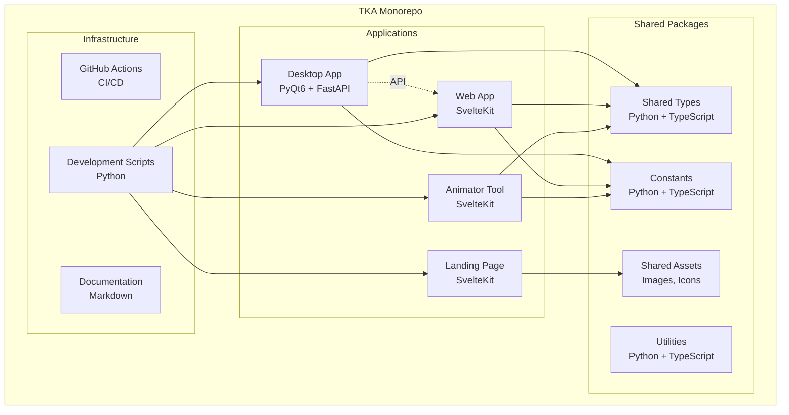
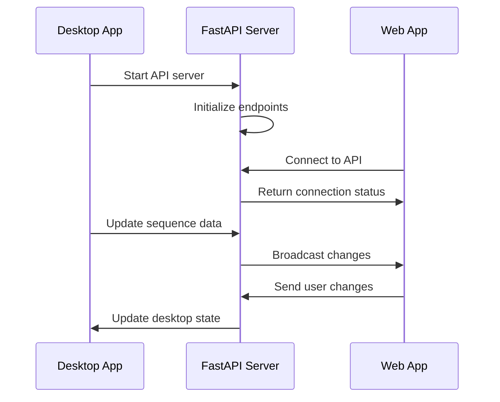
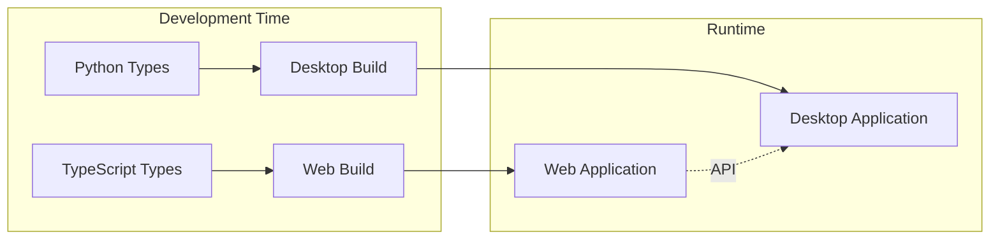

# TKA Monorepo Architecture

This document describes the overall architecture of the TKA monorepo and how the different components interact.

## 🏗️ High-Level Architecture

## 📦 Component Overview

### Applications Layer

#### Desktop Application (`apps/desktop/`)
- **Framework**: PyQt6 for UI, FastAPI for API
- **Architecture**: Clean architecture with dependency injection
- **Responsibilities**:
  - Primary sequence construction interface
  - Advanced editing capabilities
  - Local data persistence
  - API server for web integration

#### Web Application (`apps/web/`)
- **Framework**: SvelteKit with TypeScript
- **Architecture**: Component-based with stores
- **Responsibilities**:
  - Browser-based sequence editing
  - Real-time collaboration
  - Cross-platform access
  - Progressive Web App features

#### Landing Page (`apps/landing/`)
- **Framework**: SvelteKit
- **Purpose**: Marketing and documentation website
- **Features**:
  - Product showcase
  - Download links
  - Documentation portal
  - Community resources

#### Animator Tool (`apps/animator/`)
- **Framework**: SvelteKit with Canvas API
- **Purpose**: Specialized animation creation
- **Features**:
  - Frame-by-frame animation
  - Timeline editing
  - Export capabilities
  - Effect libraries

### Shared Packages Layer

#### Shared Types (`packages/shared-types/`)
- **Purpose**: Consistent data models across applications
- **Languages**: Python and TypeScript
- **Key Types**:
  - `SharedSequenceType`: Sequence data structure
  - `SharedBeatType`: Beat information
  - `SharedMotionType`: Motion definitions
  - Enums for motion types, locations, etc.

#### Constants (`packages/constants/`)
- **Purpose**: Shared configuration and constants
- **Languages**: Python and TypeScript
- **Contents**:
  - API endpoints
  - Error messages
  - Default values
  - Validation limits

#### Utilities (`packages/utils/`)
- **Purpose**: Common utility functions
- **Languages**: Python and TypeScript
- **Functions**:
  - Data validation
  - Format conversion
  - Mathematical calculations
  - Helper functions

#### Assets (`packages/assets/`)
- **Purpose**: Shared visual resources
- **Contents**:
  - Icons and images
  - Fonts and styles
  - Animation assets
  - Brand resources

### Infrastructure Layer

#### Development Scripts (`scripts/`)
- **Purpose**: Unified development workflow
- **Key Scripts**:
  - `dev.py`: Main development orchestrator
  - `setup.py`: Environment setup
  - `clean.py`: Cleanup utilities
  - `restructure_monorepo.py`: Migration tools

#### CI/CD (`/.github/`)
- **Purpose**: Automated testing and deployment
- **Components**:
  - GitHub Actions workflows
  - Dependabot configuration
  - Issue templates
  - Security scanning

## 🔄 Data Flow

### Desktop to Web Communication

### Shared Package Usage

## 🏛️ Architectural Principles

### 1. Separation of Concerns
- Each application has a single responsibility
- Shared code is extracted to packages
- Clear boundaries between layers

### 2. Type Safety
- Shared types ensure consistency
- TypeScript for web applications
- Python type hints for desktop

### 3. Modularity
- Independent deployable applications
- Reusable shared packages
- Pluggable architecture

### 4. Developer Experience
- Unified development scripts
- Consistent tooling across applications
- Automated testing and deployment

### 5. Maintainability
- Clear documentation
- Consistent coding standards
- Automated dependency management

## 🔧 Technology Stack

### Frontend Technologies
- **SvelteKit**: Web framework for reactive UIs
- **TypeScript**: Type-safe JavaScript
- **Tailwind CSS**: Utility-first CSS framework
- **Vite**: Fast build tool and dev server

### Backend Technologies
- **PyQt6**: Desktop application framework
- **FastAPI**: Modern Python web framework
- **Pydantic**: Data validation and serialization
- **SQLAlchemy**: Database ORM (if needed)

### Development Tools
- **Python**: Scripting and desktop development
- **Node.js**: JavaScript runtime and package management
- **npm**: Package manager and workspace orchestration
- **GitHub Actions**: CI/CD automation

### Testing Frameworks
- **pytest**: Python testing framework
- **Vitest**: Fast unit testing for JavaScript
- **Playwright**: End-to-end testing
- **Coverage.py**: Python code coverage

## 📈 Scalability Considerations

### Horizontal Scaling
- Web applications can be deployed to multiple servers
- API can be load-balanced
- Static assets served via CDN

### Vertical Scaling
- Desktop application runs locally
- Web applications optimized for performance
- Efficient data structures and algorithms

### Development Scaling
- Monorepo supports multiple teams
- Clear ownership boundaries
- Independent deployment pipelines

## 🔒 Security Architecture

### Data Protection
- Local data encryption for desktop
- HTTPS for all web communications
- Input validation and sanitization

### Access Control
- API authentication and authorization
- Role-based permissions
- Secure session management

### Vulnerability Management
- Automated security scanning
- Dependency vulnerability monitoring
- Regular security updates

## 🚀 Deployment Architecture

### Desktop Application
- Standalone executable
- Auto-update mechanism
- Local data storage

### Web Applications
- Static site generation
- CDN deployment
- Progressive Web App features

### API Server
- Embedded in desktop application
- Local network access
- Optional cloud deployment

This architecture provides a solid foundation for the TKA project while maintaining flexibility for future growth and changes.
